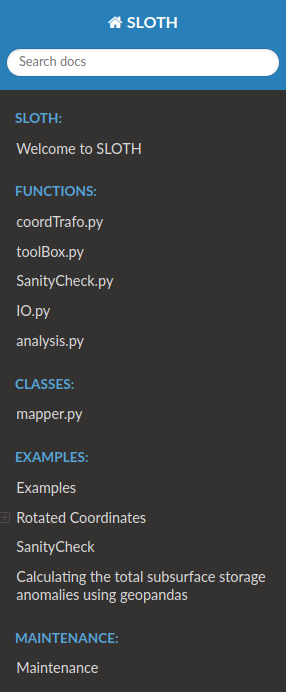

# Maintenance

A major part of this documentation is written as [DocString](https://en.wikipedia.org/wiki/Docstring) of the relatad function within the Python scritps. The other part of this documentation is written in simple [markdown](https://markdown.de/) files. Both are quite portable and easy to write, but the downside is that the resulting collection of files is not easy for the user to browse. To solve this problem, [sphinx](https://www.sphinx-doc.org/en/master) is used to render a nice looking and searchable HTML documentation based on the markdown files, which can be opened in any web browser. To enable direct access for every user, the rendered documentation is then published with [GitHub-Pages](https://docs.github.com/en/pages/getting-started-with-github-pages/about-github-pages). Furthermore, the rendering and deployment process is automated using [GitHub workflows](https://docs.github.com/en/actions/using-workflows/about-workflows) to make it as easy as possible to update this documentation.

The following sections describe all the steps and settings required to set up, understand, and maintain the above process chain on GitHub.

## Rendering with sphinx

[Sphinx](https://www.sphinx-doc.org/en/master) is a document generator written in Python that aims to render intelligent documentation in various output formats based on reStructuredText and markdown files. 
The backbone of Sphinx is a configure file (`conf.py`) that defines the features of the final documentation and an index file (`index.rst`) that forms the entry point of the final documentation, linking all involved markdown or reStructuredText files used for rendering.  
For details information on how to get started see the official [GettingStarted website](https://www.sphinx-doc.org/en/master/usage/quickstart.html).

### conf.py
Setting up the configure file is quite straightforward and well explained in the [official documentation](https://www.sphinx-doc.org/en/master/usage/configuration.html). Two settings are highlighted below, which are mandatory for the current documentation:   

**Extensions**:  
Below extensions for sphinx are used and needed to render the documentation:
``` bash
extensions = [
        'sphinx.ext.autodoc',
        'sphinx.ext.viewcode',
        'sphinx.ext.napoleon',
        'sphinx.ext.mathjax',
        'sphinx_copybutton',
        'myst_nb',
        ]
```

**MyST-NB parser**:   
[MyST](https://myst-parser.readthedocs.io/en/latest/) is a python parser for the markdown language available as an extension for sphinx. [MyST-NB](https://myst-nb.readthedocs.io/en/latest/index.html) therby is a special version, which ia abele to render Jupyter Notebook (`.ipynb`) into the final HTML documentaiton. Further MyST can be used to generate link anchors, enabling to easily internally link different documentation pages. 
Using MyST requires the following setting in `conf.py`:
``` bash
myst_heading_anchors = 4

myst_enable_extensions = [
    "amsmath",                  # LaTeX equations
    "dollarmath",               # Inline LaTex
]
```

To use a link anchors, first scan the related file for available anchors
``` bash
myst-anchors -l auxiliaryscripts.md
>> <h1 id="auxiliary-scripts"></h1>
>> <h2 id="aux_migratefromscratchsh"></h2>
>> <h2 id="aux_untarmanytarssh"></h2>
>> <h2 id="aux_restagetapesh"></h2>
>> <h2 id="aux_gzipsh-and-aux_gunzipsh"></h2>
>> <h2 id="aux_sha512sumsh"></h2>
```
than use a found anchor similar as normal links in markdown:
``` bash
[aux_UnTarManyTars.sh](REL/PATH/TO/auxiliaryscripts.md#aux_untarmanytarssh)
```

### index.rst
The `index.rst` file forms the structure of the documentation and acts as a table of contents, determining which file to include in the rendering process. The structure of the `index.rst` file thereby is quite simple, just a heading and a sequence of toctrees (imagine as chapters), which in turn consist of a list of involved files to render. This can be `.rst`, `.md`, or even `.ipynb` files!

Below is an example of an `index.rst` file with a screenshot of the generated table of contents:
> **To be Noted:**   
> The actual text in the rendered TOC (such as `Rotated Coordinates` or `Maintenance`) is taken from the headline of the associated markdown file, even if the file names are identical by chance!

[](./ScreenshotTableOfContent_CODE.png)[](./ScreenshotTableOfContent_IMG.png)

## GitHub Pages

At their core, GitHub Pages are static websites hosted by GitHub and filled with content provided by a repository. With GitHub Pages, the user does not have to worry about the technicalities of hosting websites. All you need to do is provide the website content in a supported format. GitHub Pages are disabled by default, and must be enabled in the repository settings. GitHub pages are free, but require a public repository.

For this documentation, we have chosen to deploy the GitHub page from an extra branch, which means that we provide the content of the website from a separate branch of the relevant repository. If you look at the repository you will see that there are at least two branches. The [`master` branch](https://github.com/HPSCTerrSys/SLOTH/tree/master) and a [`gh-pages` branch](https://github.com/HPSCTerrSys/SLOTH/tree/gh-pages). The `gh-pages` branch is automatically created when you enable GitHub Pages, and is a special form of a branch, because it does not contain any content from the repository itself.  In our case, the `gh-pages` branch only contains the output of sphinx rendering, so the content of the website.   
Rendering the website and filling the `gh-pages` branch is automated using GitHub workflows, which are explained in the following section [GitHub workflows](#github-workflows-cicd). 
The following screenshot shows all the settings needed to enable GitHub pages:
[](./ScreenshotSettingGitHubPages.png)

## GitHub workflows (CI/CD)

GitHub workflows are the functionality to execute a predefined set of programs in a defined order when a defined condition is met. 
These processing chains / workflows are defined in YAML files as a kind of abstract cookbook, e.g. saying   

> When event A is triggered, execute job B, which consists of steps C, D, and E.  

These workflows can be as complex as you like by combining many and nested job-steps, which makes them very powerful! Each YAML file is a workflow, and you can have many workflows running in parallel with your repository, each for a different task. In order to be recognised as a workflow by GitHub, the YAML files must be saved under [`.github/workflows`](https://github.com/HPSCTerrSys/SLOTH/tree/master/.github/workflows).

This repository contains three workflows, all aimed at rendering and deploying this documentation, but with slight differences depending on the triggering event.

Below is a annotated sample YAML file to get a quick feel for it:
[](./ScreenshotYAMLFile.png)  

Again imagine this workflow as a cook-book, executed on a blank machine. So when the above workflow is triggered 

- A machine is started
- Ubuntu is selected as the operating system
- The content we want to render is checked out to this machine
- The environment is set-up by using a pre-defined python environment and installing the necessary programs
- The documentation is rendered using sphinx
- The rendered documentation is deployed to the `gh-pages` branch and published to the web.

As we chose Ubuntu as the operating system, we can run all available linux commands as job-steps, e.g. `pip install --upgrade myst-parser`, but also more complex predefined job-steps, e.g. `uses: peaceiris/actions-gh-pages@v3`, which is a kind of makro that combines a more complex task into a single command. There are many predefined makros available for GitHub workflows, which could be used for free - see [GitHub-Marketplace](https://github.com/marketplace).


## How to contribute 
  
To properly contribute to **SLOTH** with your own functions, methods and classes, create a local clone of this repository, open a new branch and commit your changes. That way everything stays clean and the master branch is not messed up. Within this new branch, you can develop whatever you like, as you are not interfering with the master branch.  

To do this:
``` bash
# clone SLOTH as described within the 'Getting Started' section
cd SLOTH
git checkout -b YOURDEVELOPBRANCHNAME
# Start developing
# [...]
# If ready push to GitHub (ALWAYS PULL BEFORE!)
git pull origin YOURDEVELOPBRANCHNAME
git push origin YOURDEVELOPBRANCHNAME
# And open a PR from the GitHub website.
```

When you are finished developing, commit your changes with a meaningful commit message, push the new commits to the remote, and create a PR (pull request) to start merging your changes into the master branch. Someone from the maintenance team will review your request and decide whether your development is ready to move to the master branch and become part of **SLOTH**.

It is always welcome to provide an example of your new development, to help other users better understand your methods.  
The easiest and most useful way is to write a small example in a Jupyter notebook, e.g. using the [JSC Jupyter Hub](https://jupyter-jsc.fz-juelich.de/hub/home). You can download this Jupyter notebook as an `.ipynb` file, which contains all the generated output and can be easily included in your documentation. To include the example in SLOTH, put the example files in `examples/` and link the new file with the `index.rst` (see examples already included). Render the documentation and the new example will be included.

For your local changes to the documentation, all you need is a text editor to modify the individual `.md` files, DocStrings, Python scripts that make up the documentation. However, to see if your changes render as expected, we recommend that you use sphinx to build the entire documentation. Do not use a markdown editor for this, as the markdown flavour used may differ from that used by sphinx, leading to different results.
Rendering/building the documentation is done by changing to `doc/` and running the command:

```
sphinx-build -a . _build
``` 
This will create the documentation in `doc/_build/`.   
Simply browse to this directory and open `index.html` which should show you the locally rendered documentation in your default web browser.